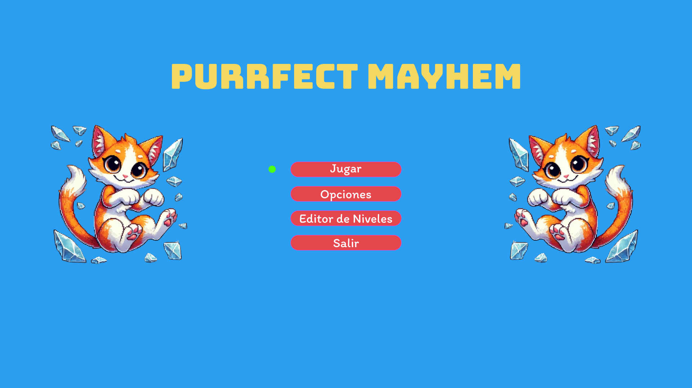
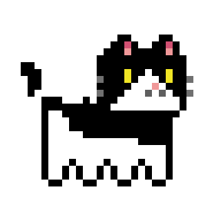
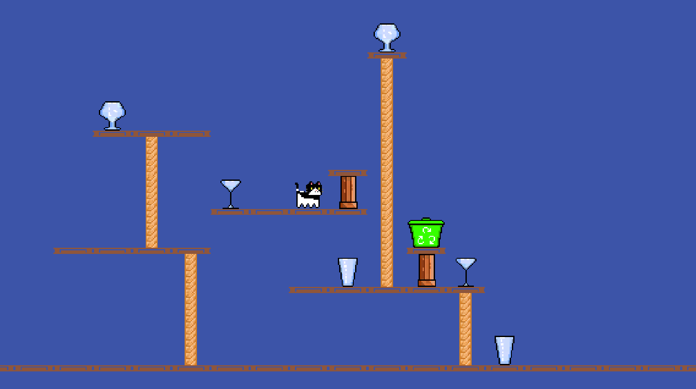
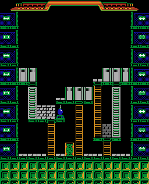
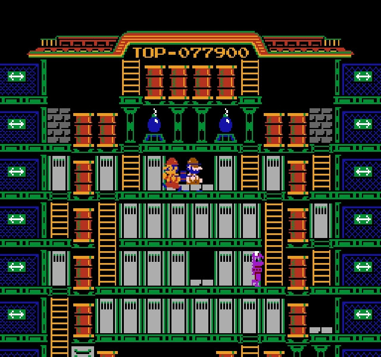

# Índice
- [Visión General del juego](#visión-general-del-juego)
  - [Título del Juego](#título-del-juego)
  - [Elevator Pitch](#elevator-pitch)
  - [Género y Plataforma](#género-y-plataforma)
- [Concepto del Juego](#concepto-del-juego)
  - [Resumen Narrativo](#resumen-narrativo)
  - [Mecánicas Principales](#mecánicas-principales)
  - [Estilo Visual](#estilo-visual)
- [Mecánicas de Juego](#mecánicas-de-juego)
- [Narrativa](#narrativa)
  - [Idea](#idea)
  - [Logline](#logline)
  - [Sinopsis](#sinopsis)
  - [Arquetipo Narrativo](#arquetipo-narrativo)
  - [Estructura Narrativa](#estructura-narrativa)
  - [Elementos Adicionales](#elementos-adicionales)
- [Personajes](#personajes)
  - [Protagonista](#protagonista)
- [Diseño de niveles](#diseño-de-niveles)
  - [Boceto y estructura del nivel](#boceto-y-estructura-del-nivel)
  - [Objetivos del nivel](#objetivos-del-nivel)
  - [Obstáculos y desafíos](#obstáculos-y-desafíos)
  - [Eventos y elementos de ambiente](#eventos-y-elementos-de-ambiente)
- [Características del Nivel](#características-del-nivel)
- [Referencias Visuales](#referencias-visuales)
- [Elementos del Nivel](#elementos-del-nivel)
  - [Lista de Assets a desarrollar](#lista-de-assets-a-desarrollar)
  - [Enemigos, obstáculos y puntuación](#enemigos-obstáculos-y-puntuación)
  - [Logros del nivel 1](#logros-del-nivel-1)
- [Música y Sonido](#música-y-sonido)
  - [Clasificación de Sonidos](#clasificación-de-sonidos)
- [Mercado Objetivo](#mercado-objetivo)
  - [Público](#público)
  - [Posicionamiento en el mercado](#posicionamiento-en-el-mercado)
- [Equipo y Capacidades](#equipo-y-capacidades)
  - [Equipo detrás del juego](#equipo-detrás-del-juego)
  - [Habilidades](#habilidades)
- [Plan de Desarrollo](#plan-de-desarrollo)
  - [Cronograma](#cronograma)
- [Hook único](#hook-único)
- [Inspiración](#inspiración)
- [Plan de pruebas](#plan-de-pruebas)
  - [Batería de pruebas](#batería-de-pruebas)
  - [Smoke Tests](#smoke-tests)
  - [Pruebas unitarias](#pruebas-unitarias)
  - [Pruebas A/B posibles](#pruebas-ab-posibles)
- [Requisitos técnicos de la demo](#requisitos-técnicos-de-la-demo)
  - [Plataforma objetivo](#plataforma-objetivo)
  - [Motor y lenguaje](#motor-y-lenguaje)
  - [Herramientas y software](#herramientas-y-software)
  - [Controles soportados](#controles-soportados)
  - [Sistema de guardado](#sistema-de-guardado)
- [Monetización, distribución y plan de parches](#monetización-distribución-y-plan-de-parches)
  - [Monetización](#monetización)
  - [Distribución](#distribución)
  - [Plan de parches/mejoras post-demo](#plan-de-parchesmejoras-post-demo)
- [Producto final, marketing y publicidad](#producto-final-marketing-y-publicidad)
  - [Producto básico](#producto-básico)
  - [Producto esperado](#producto-esperado)
  - [Producto aumentado](#producto-aumentado)
  - [Producto potencial](#producto-potencial)
  - [Transformación a producto completo](#transformación-a-producto-completo)
  - [Mercado objetivo](#mercado-objetivo-1)

---

## Visión General del Juego

### Título del Juego
**Purrfect Chaos**

### Elevator Pitch
En *Purrfect Chaos*, los jugadores controlan a un gato travieso que debe romper objetos frágiles mientras esquiva perros guardianes a través de los diferentes niveles.

### Género y Plataforma
- **Género**: Acción, puzzle, plataforma y estrategia.
- **Plataforma**: PC.

---

## Concepto del Juego

### Resumen Narrativo
Eres un gato con una misión: sembrar el caos destruyendo todo a tu paso, desde vasos y copas hasta cualquier objeto de cristal. Pero cuidado: los perros guardianes te siguen los pasos y harán todo lo posible por atraparte.

### Mecánicas Principales
- **Objetivo**: Rompe todos los objetos del nivel para avanzar.
- **Movimientos**: El gato corre por el escenario y puede subir y bajar por torres de juguetes para gatos, que también pueden usar los perros.

### Estilo Visual
- **2D Pixel art.**
- **Mockup del menú inicial del juego.**

## Mecánicas de Juego

| Mecánica               | Tipo     | Necesidad                         | Reglas                                      |
|------------------------|----------|-----------------------------------|--------------------------------------------|
| Movimiento del gato     | Primaria | Desplazamiento del personaje      | Puede moverse en 4 direcciones con WASD/Flechas y/o Gamepad. |
| Romper objetos          | Primaria | Objetivo principal del juego      | El gato golpea objetos frágiles con sus zarpas para destruirlos. |
| Perros guardianes       | Secundaria | Enemigos que impiden la tarea del jugador | Persiguen al jugador para atraparlo. |
| Planificación de recorrido | Secundaria | Optimizar el desplazamiento y evitar a los enemigos | Estrategia para romper todos los objetos antes de ser atrapado. |
| Elementos interactivos  | Terciaria | Afectar al entorno y generar dinámicas emergentes | Algunos objetos pueden caerse al ser golpeados. |
| Generación de puntuación | Sistema | Recompensar la eficiencia del jugador | Se otorgan puntos según los objetos rotos. |

---

## Narrativa

### Idea
Caos y travesuras felinas en escenarios variados.

### Logline
Controla a un gato travieso que debe romper todos los objetos frágiles de cada nivel mientras esquiva a los perros guardianes.

### Sinopsis
En *Purrfect Chaos*, el jugador encarna a Neko, un gato que adora el caos y la destrucción. Su objetivo es simple: romper todo a su paso sin ser atrapado. Sin embargo, los perros guardianes están listos para detenerlo. A medida que avanza por diferentes escenarios, cada uno con sus propios desafíos, Neko tendrá que usar su agilidad y astucia para completar su misión.

### Arquetipo Narrativo
La travesura del antihéroe. Neko no es un héroe tradicional, sino un agente del caos que desafía el orden establecido (representado por los perros guardianes y el entorno frágil que debe destruir).

### Estructura Narrativa
- **Introducción**: Neko llega a un nuevo escenario y empieza su misión destructiva.
- **Desarrollo**: Los niveles aumentan en dificultad con nuevos desafíos.
- **Clímax**: Niveles especialmente difíciles donde hay más perros guardianes y escenarios más complejos.
- **Desenlace**: El último objeto del último nivel es destruido y Neko huye victorioso.

### Elementos Adicionales
Interacciones de sonido que aporten personalidad a Neko, como maullidos de victoria o al ser atrapado.

---

## Personajes

### Protagonista

- **Nombre**: Neko
- **Importancia en la historia**: Es el protagonista absoluto. Todo el gameplay gira en torno a él y su objetivo de romper objetos.
- **Rasgos característicos**: Travieso, ágil, escurridizo, carismático.
- **Evolución o transformación en el juego**: Ninguna. Neko se mantiene fiel a su naturaleza desde el inicio hasta el final del juego, siempre travieso y con el mismo objetivo de destruir todo a su paso.

---

## Diseño de Niveles

### Boceto y estructura del nivel

El nivel 1 de *Purrfect Chaos* está diseñado como una estructura de varias plataformas y cuerdas interconectadas.

### Objetivos del nivel
- Introducir la mecánica de destrucción de objetos.
- Presentar a los primeros enemigos.
- Completar el nivel rompiendo todos los objetos requeridos.

### Obstáculos y desafíos
- Enemigos persiguiendo al jugador.
- Objetos frágiles ubicados en diferentes posiciones.

### Eventos y elementos de ambiente
- Ruptura de objetos cuando son golpeados.

---

## Características del Nivel
- **Tamaño**: Todo el nivel es visible en una sola pantalla estática.
- **Altura**: Varias plataformas con distintas alturas.
- **Tipo de movimiento**: Plataforma en 2D con cuerdas.
- **Estilo visual**: Pixel art con una paleta de colores vibrante y detallada.
- **Interacción**: Elementos destructibles y enemigos.
- **Dificultad**: Baja-media, diseñado como introducción a mecánicas básicas.

---

## Referencias Visuales

---

## Elementos del Nivel

### Lista de Assets a desarrollar
- Fondo (único para todos los niveles, simple).
- Sprites del personaje principal (hecho).
- Sprites de los enemigos (hechos).
- Sprites de las plataformas y cuerdas (hecho).
- Sprites de objetos destructibles (vasos, pilares, hechos).
- Elementos de interfaz de usuario (UI), como puntuación y vidas en la parte superior.

### Enemigos, obstáculos y puntuación

| Nombre          | Tipo    | Ubicación       | Comportamiento                         |
|-----------------|---------|-----------------|----------------------------------------|
| Perro grande   | Enemigo | Por todo el nivel | Persigue al jugador y es rápido        |
| Perro pequeño  | Enemigo | Por todo el nivel | Persigue al jugador y es lento         |
| Puntos por romper objetos | Puntuación | Al destruir vasos y pilares | Otorgan puntos según el tipo de objeto roto |

### Logros del nivel 1
- **Velocidad Gatuna** → Completa el nivel en menos de X segundos.

---

## Música y Sonido

### Clasificación de Sonidos
- **DX (Diálogo)**: No hay diálogos en el juego.
- **MX (Música)**: Tema principal del nivel (melodía animada), música de victoria al completar el nivel.
- **SFX (Efectos de sonido)**: Sonido de caída del personaje, golpes al romper objetos.
- **FOL (Foley)**: Pasos del personaje al moverse.
- **BG (Background)**: No hay sonidos ambientales o ruido de entorno.

---

## Mercado Objetivo

### Público
- Intereses: Juegos retro, plataformas desafiantes y experiencias casuales pero adictivas.

### Posicionamiento en el mercado
- Inspirado en clásicos como *Wrecking Crew*, pero con una temática única y un diseño atractivo.
- Ideal para jugadores nostálgicos y nuevos jugadores que buscan diversión sencilla y directa.

---

## Equipo y Capacidades

### Equipo detrás del juego
- **Guillermo**: Diseñador principal y programador.

### Habilidades
- Aprendizaje en Unity.
- Conocimientos básicos de pixel art y animaciones.

---

## Plan de Desarrollo

### Cronograma
- **Febrero - Marzo**: Diseño artístico inicial y creación del prototipo jugable.
- **Abril - Mayo**: Menús, desarrollo de niveles, opciones de configuración, editor de niveles.
- **Junio**: Ajustes finales y pruebas de usuario.

---

## Hook único
**¿Por qué *Purrfect Chaos* es diferente?**
Es un homenaje a los juegos retro con una mecánica clásica renovada, protagonizado por un gato adorable y lleno de personalidad. Su mezcla de plataformas y estrategia lo hace accesible pero desafiante.

---

## Inspiración
- Inspirado en el videojuego *Wrecking Crew* de la NES.

---

## Plan de pruebas

### Batería de pruebas
- El jugador puede moverse en las 4 direcciones (WASD, flechas, gamepad).
- El jugador puede subir y bajar por las cuerdas correctamente.
- El jugador puede romper vasos y pilares.
- El jugador pierde una vida al ser tocado por un enemigo.
- El sistema de puntuación funciona (100/200/300 por cada tipo de vaso).
- El jugador gana una vida al llegar a 5000 puntos.
- El Game Over se muestra cuando se pierden todas las vidas.

### Smoke Tests
- El juego arranca sin errores.
- El primer nivel carga todos los assets.

### Pruebas unitarias
- Comprobación de la ruptura del vaso para conseguir puntos.
- Comprobación del cálculo de puntuación para conseguir una vida extra.

### Pruebas A/B posibles
- A/B Test de dificultad: dos versiones del nivel (una con más enemigos o más cuerdas) para ver cuál genera más engagement o retención.
- A/B Test de marketing: distintos textos en la pantalla de título para ver cuáles captan más atención.

---

## Requisitos técnicos de la demo

### Plataforma objetivo
- PC (Windows).

### Motor y lenguaje
- Motor de juego: Unity 6 (6000.0.25f1).
- Lenguaje de programación: C#.

### Herramientas y software
- IDE: VS Code.
- Editor gráfico: LibreSprite.
- Control de versiones: Git + GitHub.
- Sistema de pruebas: Unity Test Framework.
- Posible uso futuro: Level Editor interno para crear niveles automáticamente.

### Controles soportados
- Teclado (WASD y flechas).
- Gamepad.

### Sistema de guardado
- No incluye guardado clásico. Solo se usan PlayerPrefs para almacenar temporalmente el número de vidas restantes. No hay opción de continuar ni guardar partida entre sesiones.

---

## Monetización, distribución y plan de parches

### Monetización
- Modelo: Gratuito con donaciones (Itch.io con opción de donar).
- Argumento: Al ser un proyecto indie, corto y experimental, un modelo gratuito ayuda a llegar a más gente y recoger feedback. Las donaciones pueden ayudar a futuras mejoras o expansiones.

### Distribución
- Plataformas: Itch.io inicialmente.
- Si el feedback es bueno: considerar subir a Steam (tras pulido completo).

### Plan de parches/mejoras post-demo
- Corrección de bugs.
- Mejoras en animaciones y efectos.
- Mejoras en sonidos y música.
- Añadir nuevos niveles.
- Refinar la IA de los enemigos.
- Sistema de selección de niveles o guardado avanzado.

---

## Producto final, marketing y publicidad

### Producto básico
- Videojuego de plataformas de acción en 2D donde el jugador controla a un gato (Neko) cuyo objetivo es romper vasos y esquivar perros enemigos para completar niveles.
- Ofrece diversión rápida y directa, enfocada en la destrucción y la habilidad de esquivar enemigos, ideal para partidas cortas y satisfactorias.

### Producto esperado
- El jugador espera un control fluido y preciso del personaje, gráficos simpáticos y coherentes, desafíos de dificultad progresiva, un sistema de puntuación claro, gestión de vidas y niveles que se puedan completar de forma satisfactoria. También espera que al romper objetos haya una respuesta visual y sonora adecuada.

### Producto aumentado
- Estética y animaciones carismáticas que refuerzan la personalidad divertida del juego.
- Compatibilidad tanto con teclado como con mando (Input System adaptado).
- Música y sonidos inspirados en clásicos de videojuegos (estilo retro) que potencian la nostalgia.
- Interfaz de usuario (UI) clara, atractiva y funcional adaptada a pantallas modernas.

### Producto potencial
- Nuevos tipos de enemigos.
- Modos de juego alternativos (modo contrarreloj, modo supervivencia, etc.).
- Editor de niveles para que los jugadores creen y compartan sus propios niveles.
- Personalización del personaje (distintos gatos, skins, accesorios).
- Rankings online de puntuaciones.
- Portar el juego a otras plataformas (por ejemplo, Nintendo Switch, móviles, etc.).
- Cooperativo local para dos jugadores.

### Transformación a producto completo
- Número final de niveles: 30 (Intención de hacer 100 niveles).
- Progreso visible: Selección de nivel o desbloqueo progresivo.
- Final animado o pantalla de victoria.
- Más tipos de vasos y enemigos.

### Mercado objetivo
- Jugadores casuales nostálgicos de NES.
- Fans de juegos tipo arcade o retro con mecánicas simples.
- Público indie que disfruta de propuestas originales y simpáticas.
